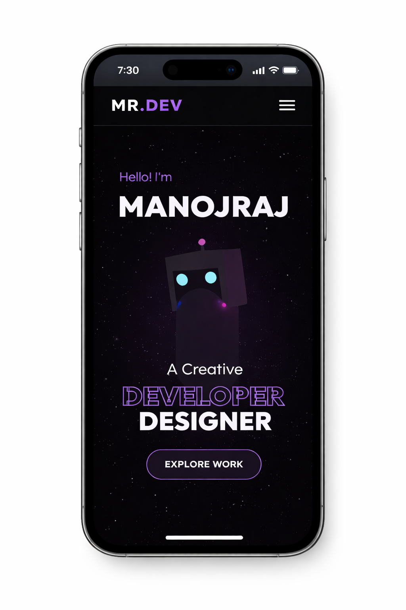

# 🌌 Ultimate 3D Animation Portfolio

<p align="center">
  
  
  
  
</p>

---

## ✨ Immersive Digital Experience

Welcome to the **Ultimate 3D Animation Portfolio**. This project isn't just a website; it's a journey through a digital landscape crafted with precision and passion. 

### 🖥️ Desktop Preview
> [!IMPORTANT]
> **Experience the Full Immersion**
> The desktop view features an ultrawide split-layout with a reactive 3D avatar and dynamic lighting.
> 
> 

### 📱 Mobile Excellence (iPhone 15 Pro)
> [!TIP]
> **Pixel-Perfect Responsiveness**
> Optimized specifically for the iPhone 15 Pro, ensuring every animation and interaction feels native.
> 
> <p align="center">
>   
> </p>

---

## 🚀 Core Capabilities

- **🌀 3D Navigation**: A custom-built scroll bridge that synchronizes Three.js cameras with HTML content.
- **💎 Glassmorphic UI**: Premium translucent elements that blur the line between 3D and 2D.
- **⚡ Supercharged Performance**: Built with Vite for nearly instantaneous load times.
- **📧 Gaming-Style Contact**: A high-interaction contact form inspired by modern AAA game interfaces.

## 🛠️ Tech Stack & Tools

| Component | Technology | Role |
| :--- | :--- | :--- |
| **Animation** | Framer Motion | UI Transitions & Text Effects |
| **3D Rendering** | React Three Fiber | Core Engine |
| **Environment** | Three.js | Scene Management |
| **Styling** | Vanilla CSS | Custom Design System |

## ⚡ Quick Start

1. **Install Dependencies**
   ```bash
   npm install
   ```
2. **Launch Portal**
   ```bash
   npm run dev
   ```

---

## 👤 Credits

Developed with passion by **ManojRaj**.

<p align="center">
  <a href="https://github.com/manojrajm">
    
  </a>
  <a href="mailto:gauthamtamizha007@gmail.com">
    
  </a>
</p>

---
<p align="center">
  <i>"Building the future, one pixel at a time."</i>
</p>
